# FAQ - ALS
{: .no_toc }

  

    Table of contents
  

  {: .text-delta }
- TOC
{:toc}

---

## (For ICT257 students) What to do if `rht-vmctl reset <vmname>` does not achieve its intended objective and you are still stuck with a broken `<vmname>`?

Perform the following to revert to the original checkpoint:
1. Open Hyper-V Manager
2. Click on that particular VM
3. Under the checkpoints section, click on the “RESTORE HERE!” checkpoint
4. Click on Apply button on the right
  
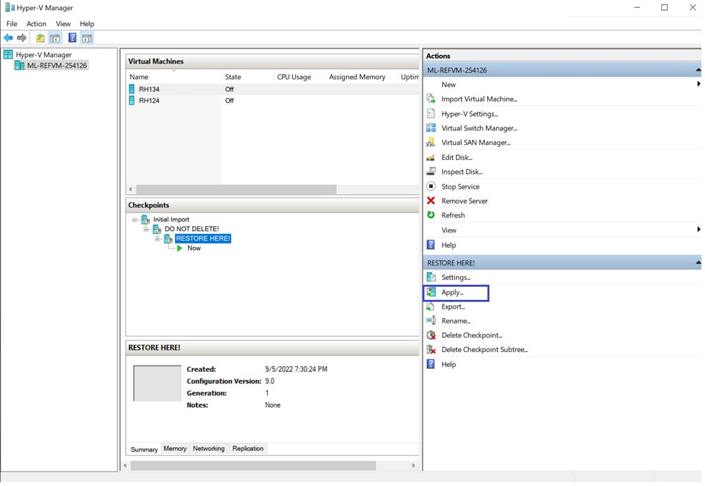

5. In this Apply Checkpoint prompt, click on Apply button.
   
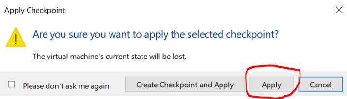

6. It will revert back to the default state and please try to start the virtual machine again.

---

## After signing into Revit, it shows "No active subscription or trial could be found for this email address".

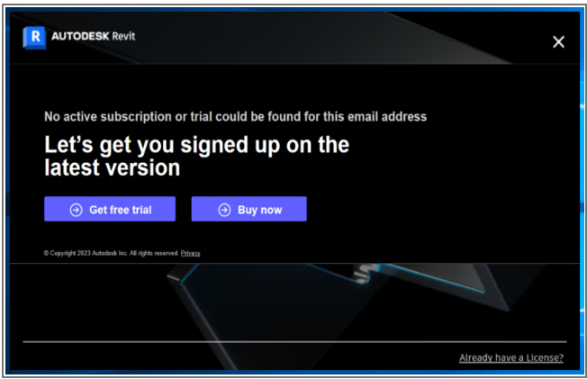

As the student registration and/or eligibility check is incomplete, Autodesk is unable to verify your eligibility.

To solve this issue, please ensure that you carry out all the steps listed in Section 1 and 2 of the Student User Guide.
Once you have your Autodesk account activated, launch Revit again and carry out the following:

1. Click the **Already have a License?** link on the bottom right corner.
2. **Let’s Get Started** screen will appear and then click **Switch user**.

  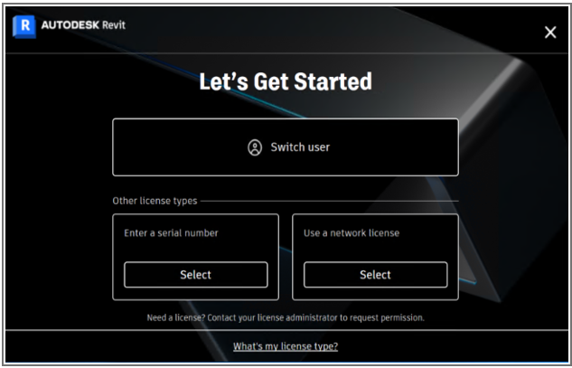

3. **Sign Out & Quit** screen will appear and then click **Continue** button.

  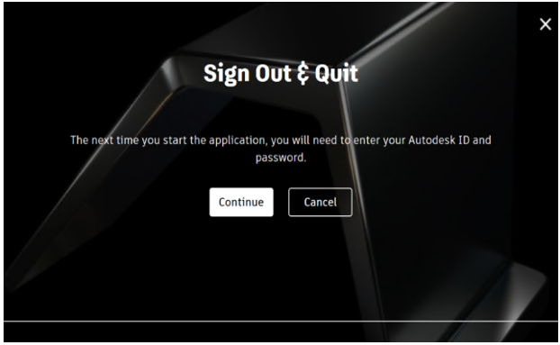

4. Click **OK** to close this warning message.

  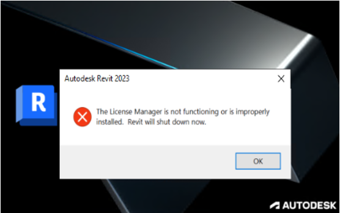

5. Launch Revit and then click **Sign in with your Autodesk ID**.

  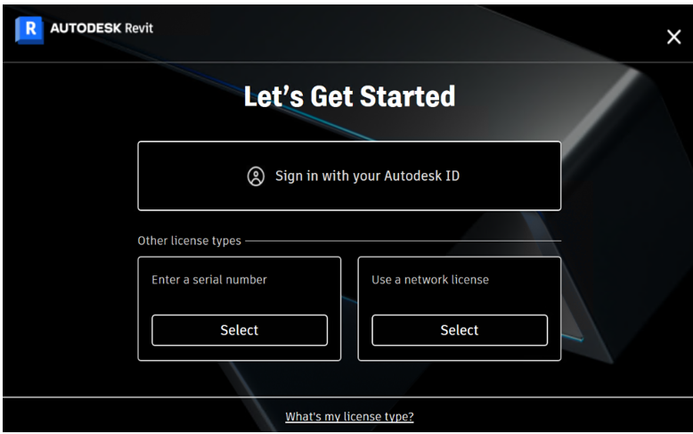

6. Follow the same steps in Section 9 of the Student User Guide to sign in.

---

## I have forgotten my password for Autodesk account.

1. Click on the **FORGOT** link.

  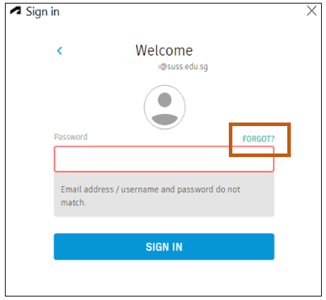

2. A message will prompt you to check your email. Carry out the instructions from the email to reset your password.

  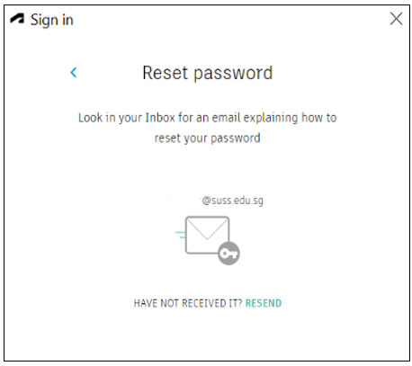

---

## I have issues signing into Revit. It says, "This email or username is not recognized".

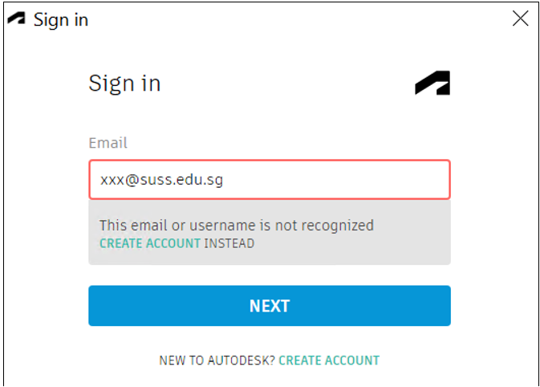

Please create your student Autodesk account using your SUSS email address.

---

## I am unable to connect to WebCentral server at the specified URL=[http://localhost:8080/archibus/]

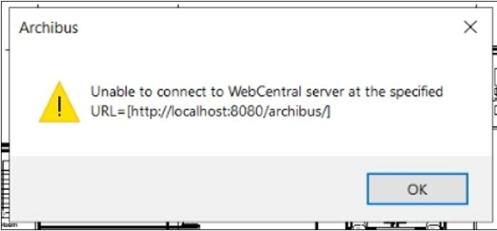

Ensure thath the Tomcat service is running. You can start the Tomcat service by clicking on the **Start Apache Tomcat** shortcut on the desktop.

---

## Error message: "Your installation has run out of licenses for this program or activity: [Application Connection Point] – Please try again later or contact your administrator concerning additional licenses."

You encounter the error message in either of these situations:

**When logging into Archibus Web Central of your web browser**

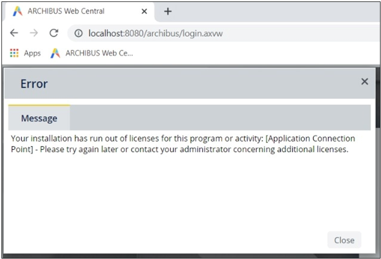

**When launching Revit appliaction**

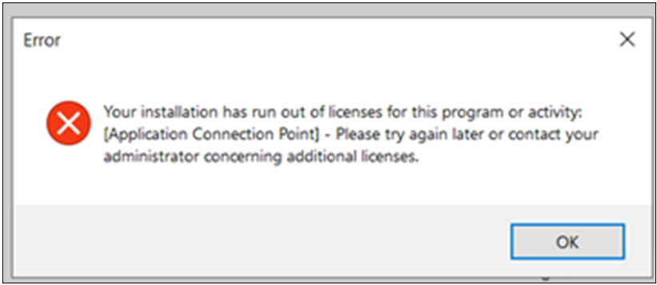

Or, you encounter the error message, **"There are no more CAD or BIM licenses available. The program has disabled these features for this session."**

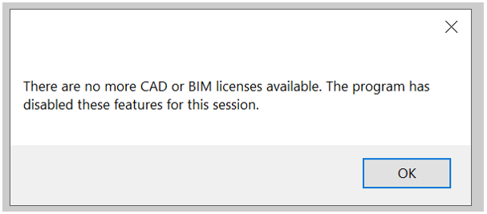

This happens when all the concurrent licenses have been used up. 
Please follow the solutions below in order. If the first solution works for you, you can skip the other solution.

<u>Solution 1</u>
1. As best practice, please sign out of the applications (Smart Client, Smart Client Extension or Web Central on browser) while not in use before signing into another application to avoid using up all the licenses.

<u>Solution 2</u>

2. Restart the Apache Tomcat service. You can start the Tomcat service by clicking on the **Start Apache Tomcat.exe** shortcut on the desktop.

---

## Error message: "The file [model name] was modified by a third-party updater Smart Client Extensions for Revit : AfmLocationUpdater which is not currently installed. If you continue to edit the file, data maintained by Smart Client Extensions for Revit : AfmLocationUpdater will not be updated properly. This may create problems when [model name] is later opened when Smart Client Extensions for Revit : AfmLocationUpdater is present.”

This warning is showing because the particular check that Revit is doing does not recognize that the old version of Smart Client Extensions for Revit is the same add-on as the new version of Smart Client Extensions for Revit; it is just seeing that the old version of SC Extensions is no longer being loaded, and that is what it is warning about.  

However, we know that the old version is not loading, that this is intentional, and that the model will not be hurt by being edited in the new version, so we can safely ignore this warning. 

You can choose either **Continue working with the file** or **Do not warn about this updater again and continue working with this file** option in this dialog.

---

## Error message: "The file [model name] was modified by the third-party updater Smart Client Extension for Revit: AfmParameterUpdater which is not currently installed. If you continue to edit the file, data maintained by Smart Client Extension for Revit: Afm Parameter will not be updated properly. This may create problems when [model name] is later opened when Smart Client Extension for Revit: AfmParameterUpdater is present."

To resolve the error:

First, open the Revit application. Then, open the Revit file from the Revit application.

---