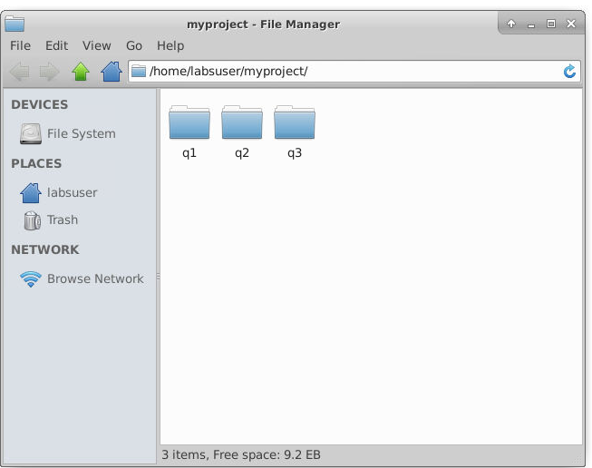

# FAQ - Submitter

## 1. If I have 1 hour left to my submission deadline and I do not have any docx, how can I submit?

You can always create a new docx before submission. Your `.docx` document cannot be empty. 

Note: You are responsible for your own submission and submitting on time.

---

## 2. If I have multiple flask projects (i.e TMA for q1 and q2), how do I prepare for submission?

You can put all of your projects under one directory and select the directory to zip up all the projects together for submission. 



---

## 3. I submitted wrongly. What should I do?

If you made a mistake for your submission, just resubmit and ignore the last submission. We will only keep the latest submission. 

---

## 4. My virtual environment is not called `venv`. What should I do?

Please run the following command on a test project first. Duplicate your project to test it. You should delete your current venv. Then run the following command to recreate venv:
```
python3 -m venv venv
source /venv/bin/activate
pip3 install -r requirements.txt
```

---

## 5. My TMA/ECA project is on my laptop. How do I submit it on Vocareum using the submitter?

Note: All TMA/ECA projects should be done on Vocareum. If you are working on your local machine, it is your responsibility to make it compatible to Vocareum. See <insert link to state that all work should be done on vocareum>

To submit on Vocareum:
1. [Upload your project to Vocareum](#3-how-do-i-upload-my-project-to-vocareum)
2. From the submitter, select the project directory to submit.
3. Click on the "Submit" button from Vocareum Lab's workspace.

---
  
## 6. Which file format is acceptable for recording?

We only accept **gifs** for recording. You need to zip up the recordings using the Vocareum zip utility.

  
---
  
## 7. The submitter is rejecting my submission because of the virtual environment. What can I do? 

You have two options. Option one is to delete all virtual environments. Another options is to name your virtual environment as **venv**. 

To recreate a virtual environment, follow the commands below. 
```
python3 -m venv venv
source /venv/bin/activate
pip3 install -r requirements.txt
```
  
Then, zip up your submission and try submitting again. 
  
---

## 8. The submitter is rejecting my submission because of my recordings. What can I do? 
  
The submitter only allow gifs as the recording. If you are using mp4, please save your recording as gif and resubmit them.

If you have multiple recordings, please zip up using the vocareum utility. 
  
---